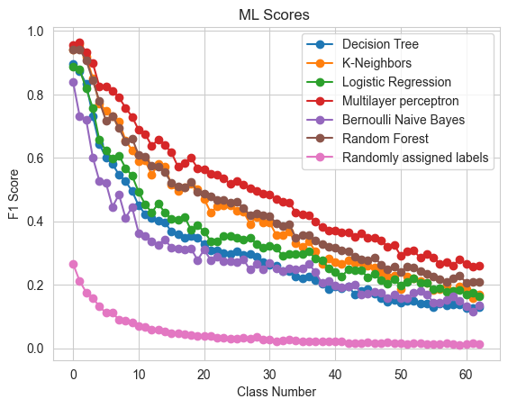
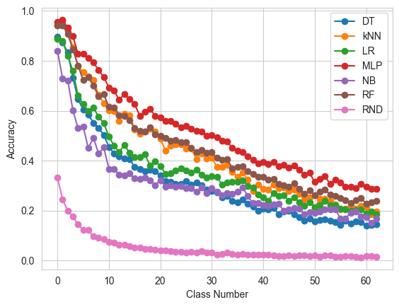

#### An examination of how the number of classes influences prediction accuracy in machine learning.

In the example below, hypothetical datasets are generated with varying numbers of classes ranging from 2 to 64. Subsequently, these datasets are attempted to be classified using different machine learning algorithms. In this context, the aim is to identify potential effects of the number of classes on the overall performance.
Classification methods:

 - Decision Tree Classifier
 - Bernoulli Naive Bayes 
 - K-Neighbors Classifier
 - LogisticR egression
 - Random Forest Classifier
 - MLP Classifier
 - Randomly (obtained by randomly assigning the results)
 


```python
import warnings
warnings.filterwarnings("ignore")
```


```python
import os
import time
import sklearn
import numpy as np
import pandas as pd
from tqdm import tqdm
from random import random
from tabulate import tabulate

import pandas as pd
import seaborn as sns
import matplotlib.pyplot as plt
%matplotlib inline
from sklearn.tree import DecisionTreeClassifier
evaluate={'Acc':"Accuracy", 'b_Acc':"Balanced Accuracy", 'F1':"F1 Score", 'kap':"Kappa", 'ROC':"Roc"}
```


```python
from sklearn.linear_model import LogisticRegression
from sklearn.tree import DecisionTreeClassifier
from sklearn.naive_bayes import BernoulliNB
from sklearn.neural_network import MLPClassifier
from sklearn.ensemble import RandomForestClassifier
from sklearn.svm import SVC
from sklearn.neighbors import KNeighborsClassifier
from sklearn.naive_bayes import GaussianNB
from sklearn.metrics import accuracy_score


```


```python
def folder(f_name): #this function creates a folder named "attacks" in the program directory.
    try:
        if not os.path.exists(f_name):
            os.makedirs(f_name)
    except OSError:
        print ("The folder could not be created!")
```


```python
def find_the_way(path,file_format,con=""):
    files_add = []
    # r=root, d=directories, f = files
    for r, d, f in os.walk(path):
        for file in f:
            if file_format in file:
                if con in file:
                    files_add.append(os.path.join(r, file))  
            
    return files_add
path="./csvs"
csv_list=find_the_way(path,".csv")
csv_list
```


    []


```python
ml_list={"DT":DecisionTreeClassifier(),
         #"XGB": XGBClassifier(),
         "NB": BernoulliNB(), 
         "kNN": KNeighborsClassifier(),
         "LR": LogisticRegression(),
         "RF":RandomForestClassifier(),
          "MLP":MLPClassifier(),
        "RND":"RND"}


```


```python
def target_name(name):
    df = pd.read_csv(name)
    target_names=sorted(list(df[df.columns[-1]].unique()))
    return target_names
```


```python
folder("results")
```

## Calculation of evaluations


```python
def score(train_time,test_time,predict,y_test,class_based_results,repeat,cv,dname,ml,sw):
    train_time=train_time[0]
    test_time=test_time[0]
    rc=sklearn.metrics.recall_score(y_test, predict,average= "macro")
    pr=sklearn.metrics.precision_score(y_test, predict,average= "macro")
    f_1=sklearn.metrics.f1_score(y_test, predict,average= "macro")     
    accuracy=sklearn.metrics.accuracy_score(y_test, predict)
    accuracy_b=sklearn.metrics.balanced_accuracy_score( y_test,predict)
    kappa=sklearn.metrics.cohen_kappa_score(y_test, predict,labels=None, weights=None, sample_weight=None)
    try:
        roc=sklearn.metrics.roc_auc_score(y_test, predict)
    except:roc=np.nan
    report = sklearn.metrics.classification_report(y_test, predict,output_dict=True)
    cr = pd.DataFrame(report).transpose()
    line=[dname,sw,repeat,cv,ml,accuracy,accuracy_b,pr,rc,f_1,kappa,roc,train_time,test_time]

    if class_based_results.empty:
        class_based_results =cr
    else:
        class_based_results = class_based_results.add(cr, fill_value=0)
    return class_based_results,line
```


```python
from sklearn.datasets import make_classification
from sklearn.linear_model import LogisticRegression
import random


def create_dataset(n):
    X, y = make_classification(
        n_samples=1000,  # row number
        n_features=10, # feature numbers
        n_informative=6, # The number of informative features
        n_redundant = 2, # The number of redundant features
        n_repeated = 2, # The number of duplicated features
        n_classes = n, # The number of classes 
        n_clusters_per_class=1,#The number of clusters per class
        random_state = 42 # random seed 
        
        
    )
    return X,y
```


```python
def ML_CV(X,y,classnumber):
    fold=5
    dname=str(classnumber)
    repetition=5
    sw=np.nan
    for ii in ml_list:
        class_based_results=pd.DataFrame()#"" #pd.DataFrame(0, index=np.arange((len(target_names)+3)), columns=["f1-score","precision","recall","support"])
        cm=pd.DataFrame()
        cv=0
        lines=[["Dataset","SW","T","CV","ML","Acc","b_Acc","Prec","Rec","F1","kap","ROC","tra-T","test-T"]]
        cm = pd.DataFrame()
        for i in range(repetition):
      
            kfold = sklearn.model_selection.KFold(n_splits=fold, shuffle=True, random_state=int(i*100))  
            cv=0

            for train_index, test_index in kfold.split(X):


                X_train, X_test = X[train_index], X[test_index]
                y_train, y_test = y[train_index], y[test_index]  

      


                results_y=[]
                cv+=1
                results_y.append(y_test)


                precision=[]
                recall=[]
                f1=[]
                accuracy=[]
                train_time=[]
                test_time=[]
                total_time=[]
                kappa=[]
                accuracy_b=[]

                    #machine learning algorithm is applied in this section
                clf = ml_list[ii]#choose algorithm from ml_list dictionary
                
                second=time.time()
                if clf!="RND":
                    clf.fit(X_train, y_train)
                    train_time.append(float((time.time()-second)) )
                    second=time.time()
                    predict =clf.predict(X_test)
                    test_time.append(float((time.time()-second)) )
                else:
                    
                    train_time.append(float((time.time()-second)) )
                    second=time.time()
                    predict = [random.randint(0, classnumber) for _ in range(len(y)//5)]
                    test_time.append(float((time.time()-second)) )
                
    
                altime=0
                class_based_results,line=score(train_time,test_time,predict,y_test,class_based_results,cv,i,dname,ii,sw)
                lines.append(line)

                
                
                
                
                df_cm = pd.DataFrame(sklearn.metrics.confusion_matrix(y_test, predict))
                if cm.empty:
                    cm =df_cm
                else:
                    cm = cm.add(df_cm, fill_value=0)
                
                
                
                
                
        results = pd.DataFrame (lines[1:], columns = lines[0])
        results.to_csv(output_csv.replace("ML",ii),index=False)
        results=results.round(3)
        del results["SW"]
        del results["ROC"]
        
        print (tabulate(results, headers=list(results.columns)))


```


```python
basla=time.time()            
    
for i  in range (2,65):
    X,y=create_dataset(i)    
    temp = str(i)
    temp=temp.zfill(3)
    output_csv=f"./results/{temp}_ML.csv"
    ML_CV(X,y,i)
    break

#print(time.time() -basla   )
```

          Dataset    T    CV  ML      Acc    b_Acc    Prec    Rec     F1    kap    tra-T    test-T
    --  ---------  ---  ----  ----  -----  -------  ------  -----  -----  -----  -------  --------
     0          2    1     0  DT    0.89     0.889   0.889  0.889  0.889  0.778    0.013     0.001
     1          2    2     0  DT    0.925    0.924   0.923  0.924  0.923  0.846    0.016     0
     2          2    3     0  DT    0.915    0.915   0.915  0.915  0.915  0.83     0.016     0
     3          2    4     0  DT    0.9      0.9     0.9    0.9    0.9    0.8      0.011     0
     4          2    5     0  DT    0.89     0.89    0.891  0.89   0.89   0.78     0         0
     5          2    1     1  DT    0.885    0.885   0.884  0.885  0.885  0.769    0         0.016
     6          2    2     1  DT    0.91     0.91    0.911  0.91   0.91   0.82     0.016     0
     7          2    3     1  DT    0.87     0.873   0.874  0.873  0.87   0.741    0.006     0
     8          2    4     1  DT    0.91     0.911   0.912  0.911  0.91   0.82     0         0
     9          2    5     1  DT    0.91     0.908   0.914  0.908  0.909  0.819    0.016     0
    10          2    1     2  DT    0.86     0.863   0.859  0.863  0.859  0.719    0         0
    11          2    2     2  DT    0.88     0.88    0.882  0.88   0.88   0.76     0.016     0
    12          2    3     2  DT    0.94     0.941   0.94   0.941  0.94   0.88     0.016     0
    13          2    4     2  DT    0.92     0.919   0.919  0.919  0.919  0.839    0         0
    14          2    5     2  DT    0.885    0.882   0.889  0.882  0.884  0.768    0.016     0
    15          2    1     3  DT    0.875    0.874   0.876  0.874  0.875  0.749    0.022     0
    16          2    2     3  DT    0.89     0.891   0.89   0.891  0.89   0.78     0.016     0
    17          2    3     3  DT    0.93     0.929   0.929  0.929  0.929  0.859    0         0
    18          2    4     3  DT    0.905    0.905   0.905  0.905  0.905  0.81     0.016     0
    19          2    5     3  DT    0.885    0.886   0.884  0.886  0.885  0.77     0         0
    20          2    1     4  DT    0.88     0.88    0.88   0.88   0.88   0.76     0.016     0
    21          2    2     4  DT    0.88     0.88    0.88   0.88   0.88   0.76     0         0
    22          2    3     4  DT    0.9      0.901   0.902  0.901  0.9    0.8      0.016     0
    23          2    4     4  DT    0.865    0.865   0.865  0.865  0.865  0.73     0         0
    24          2    5     4  DT    0.905    0.902   0.91   0.902  0.904  0.808    0.008     0
          Dataset    T    CV  ML      Acc    b_Acc    Prec    Rec     F1    kap    tra-T    test-T
    --  ---------  ---  ----  ----  -----  -------  ------  -----  -----  -----  -------  --------
     0          2    1     0  NB    0.865    0.866   0.863  0.866  0.864  0.729    0         0
     1          2    2     0  NB    0.83     0.834   0.826  0.834  0.828  0.657    0         0
     2          2    3     0  NB    0.84     0.84    0.842  0.84   0.84   0.68     0.001     0
     3          2    4     0  NB    0.8      0.8     0.801  0.8    0.8    0.6      0.003     0
     4          2    5     0  NB    0.86     0.86    0.86   0.86   0.86   0.72     0         0
     5          2    1     1  NB    0.85     0.85    0.849  0.85   0.849  0.699    0.001     0
     6          2    2     1  NB    0.815    0.815   0.815  0.815  0.815  0.63     0         0.001
     7          2    3     1  NB    0.855    0.854   0.855  0.854  0.855  0.709    0         0
     8          2    4     1  NB    0.83     0.83    0.83   0.83   0.83   0.66     0         0
     9          2    5     1  NB    0.85     0.849   0.85   0.849  0.85   0.699    0         0
    10          2    1     2  NB    0.84     0.837   0.839  0.837  0.838  0.676    0.003     0
    11          2    2     2  NB    0.81     0.81    0.811  0.81   0.81   0.62     0         0
    12          2    3     2  NB    0.875    0.876   0.875  0.876  0.875  0.75     0.002     0
    13          2    4     2  NB    0.815    0.811   0.816  0.811  0.813  0.626    0         0
    14          2    5     2  NB    0.845    0.845   0.845  0.845  0.845  0.689    0.002     0.001
    15          2    1     3  NB    0.88     0.88    0.88   0.88   0.88   0.76     0.001     0.001
    16          2    2     3  NB    0.815    0.815   0.814  0.815  0.814  0.629    0.001     0.001
    17          2    3     3  NB    0.83     0.83    0.828  0.83   0.829  0.658    0.004     0
    18          2    4     3  NB    0.8      0.799   0.801  0.799  0.799  0.599    0.001     0
    19          2    5     3  NB    0.875    0.875   0.874  0.875  0.874  0.749    0         0
    20          2    1     4  NB    0.815    0.816   0.815  0.816  0.815  0.63     0         0
    21          2    2     4  NB    0.8      0.8     0.8    0.8    0.8    0.6      0.001     0
    22          2    3     4  NB    0.87     0.87    0.87   0.87   0.87   0.74     0         0
    23          2    4     4  NB    0.835    0.836   0.836  0.836  0.835  0.67     0.001     0
    24          2    5     4  NB    0.875    0.874   0.875  0.874  0.874  0.749    0         0
          Dataset    T    CV  ML      Acc    b_Acc    Prec    Rec     F1    kap    tra-T    test-T
    --  ---------  ---  ----  ----  -----  -------  ------  -----  -----  -----  -------  --------
     0          2    1     0  kNN   0.955    0.955   0.954  0.955  0.955  0.909    0.001     0.002
     1          2    2     0  kNN   0.93     0.933   0.926  0.933  0.929  0.858    0         0.016
     2          2    3     0  kNN   0.94     0.94    0.94   0.94   0.94   0.88     0         0.016
     3          2    4     0  kNN   0.935    0.935   0.935  0.935  0.935  0.87     0.002     0.007
     4          2    5     0  kNN   0.94     0.94    0.94   0.94   0.94   0.88     0         0
     5          2    1     1  kNN   0.945    0.944   0.945  0.944  0.945  0.889    0.001     0.005
     6          2    2     1  kNN   0.935    0.935   0.935  0.935  0.935  0.87     0.002     0.009
     7          2    3     1  kNN   0.94     0.94    0.94   0.94   0.94   0.88     0         0.015
     8          2    4     1  kNN   0.925    0.925   0.926  0.925  0.925  0.85     0.001     0.01
     9          2    5     1  kNN   0.965    0.964   0.967  0.964  0.965  0.93     0         0.016
    10          2    1     2  kNN   0.915    0.916   0.914  0.916  0.914  0.829    0.012     0
    11          2    2     2  kNN   0.945    0.945   0.946  0.945  0.945  0.89     0         0.016
    12          2    3     2  kNN   0.975    0.975   0.975  0.975  0.975  0.95     0         0.016
    13          2    4     2  kNN   0.94     0.939   0.94   0.939  0.94   0.879    0.001     0.009
    14          2    5     2  kNN   0.96     0.961   0.96   0.961  0.96   0.92     0.001     0.01
    15          2    1     3  kNN   0.955    0.955   0.955  0.955  0.955  0.91     0.001     0.01
    16          2    2     3  kNN   0.935    0.934   0.935  0.934  0.935  0.869    0.001     0.008
    17          2    3     3  kNN   0.935    0.935   0.934  0.935  0.934  0.869    0.002     0.009
    18          2    4     3  kNN   0.945    0.945   0.945  0.945  0.945  0.89     0.002     0.01
    19          2    5     3  kNN   0.955    0.956   0.954  0.956  0.955  0.91     0.001     0.01
    20          2    1     4  kNN   0.95     0.949   0.951  0.949  0.95   0.9      0.001     0.008
    21          2    2     4  kNN   0.91     0.91    0.91   0.91   0.91   0.82     0         0.013
    22          2    3     4  kNN   0.96     0.96    0.96   0.96   0.96   0.92     0.001     0.009
    23          2    4     4  kNN   0.925    0.927   0.926  0.927  0.925  0.85     0         0.015
    24          2    5     4  kNN   0.95     0.95    0.95   0.95   0.95   0.9      0.002     0.008
          Dataset    T    CV  ML      Acc    b_Acc    Prec    Rec     F1    kap    tra-T    test-T
    --  ---------  ---  ----  ----  -----  -------  ------  -----  -----  -----  -------  --------
     0          2    1     0  LR    0.895    0.892   0.895  0.892  0.894  0.787    0.005     0
     1          2    2     0  LR    0.895    0.903   0.893  0.903  0.894  0.789    0.01      0
     2          2    3     0  LR    0.855    0.855   0.855  0.855  0.855  0.71     0.005     0
     3          2    4     0  LR    0.87     0.869   0.878  0.869  0.869  0.74     0.005     0
     4          2    5     0  LR    0.905    0.905   0.907  0.905  0.905  0.81     0         0
     5          2    1     1  LR    0.915    0.914   0.916  0.914  0.914  0.829    0.016     0
     6          2    2     1  LR    0.875    0.874   0.88   0.874  0.874  0.75     0         0
     7          2    3     1  LR    0.87     0.872   0.872  0.872  0.87   0.741    0.005     0
     8          2    4     1  LR    0.875    0.877   0.885  0.877  0.874  0.751    0.009     0
     9          2    5     1  LR    0.92     0.92    0.92   0.92   0.92   0.84     0         0
    10          2    1     2  LR    0.875    0.882   0.88   0.882  0.875  0.752    0.005     0
    11          2    2     2  LR    0.9      0.9     0.901  0.9    0.9    0.8      0.006     0
    12          2    3     2  LR    0.915    0.914   0.917  0.914  0.915  0.829    0.006     0
    13          2    4     2  LR    0.875    0.87    0.881  0.87   0.873  0.746    0.011     0
    14          2    5     2  LR    0.875    0.876   0.876  0.876  0.875  0.75     0.001     0
    15          2    1     3  LR    0.91     0.911   0.912  0.911  0.91   0.82     0.004     0
    16          2    2     3  LR    0.865    0.863   0.866  0.863  0.864  0.728    0.005     0
    17          2    3     3  LR    0.845    0.85    0.847  0.85   0.845  0.691    0.015     0
    18          2    4     3  LR    0.89     0.891   0.892  0.891  0.89   0.78     0.004     0
    19          2    5     3  LR    0.935    0.931   0.943  0.931  0.934  0.868    0.001     0
    20          2    1     4  LR    0.885    0.884   0.887  0.884  0.885  0.769    0.006     0
    21          2    2     4  LR    0.86     0.858   0.866  0.858  0.859  0.719    0.006     0
    22          2    3     4  LR    0.91     0.91    0.91   0.91   0.91   0.82     0         0
    23          2    4     4  LR    0.885    0.888   0.891  0.888  0.885  0.771    0.007     0.004
    24          2    5     4  LR    0.9      0.901   0.9    0.901  0.9    0.8      0.007     0
          Dataset    T    CV  ML      Acc    b_Acc    Prec    Rec     F1    kap    tra-T    test-T
    --  ---------  ---  ----  ----  -----  -------  ------  -----  -----  -----  -------  --------
     0          2    1     0  RF    0.96     0.959   0.961  0.959  0.96   0.919    0.388     0.012
     1          2    2     0  RF    0.935    0.941   0.932  0.941  0.934  0.869    0.441     0.018
     2          2    3     0  RF    0.95     0.95    0.95   0.95   0.95   0.9      0.403     0.013
     3          2    4     0  RF    0.91     0.91    0.912  0.91   0.91   0.82     0.366     0.013
     4          2    5     0  RF    0.95     0.95    0.95   0.95   0.95   0.9      0.44      0
     5          2    1     1  RF    0.93     0.928   0.931  0.928  0.929  0.859    0.4       0.014
     6          2    2     1  RF    0.95     0.95    0.95   0.95   0.95   0.9      0.386     0.013
     7          2    3     1  RF    0.935    0.938   0.938  0.938  0.935  0.87     0.41      0.029
     8          2    4     1  RF    0.925    0.926   0.928  0.926  0.925  0.85     0.378     0.016
     9          2    5     1  RF    0.955    0.954   0.956  0.954  0.955  0.91     0.433     0.015
    10          2    1     2  RF    0.92     0.925   0.921  0.925  0.92   0.84     0.345     0.016
    11          2    2     2  RF    0.94     0.94    0.94   0.94   0.94   0.88     0.325     0.015
    12          2    3     2  RF    0.955    0.956   0.955  0.956  0.955  0.91     0.421     0.016
    13          2    4     2  RF    0.935    0.932   0.939  0.932  0.934  0.868    0.435     0.017
    14          2    5     2  RF    0.95     0.951   0.95   0.951  0.95   0.9      0.425     0.016
    15          2    1     3  RF    0.94     0.941   0.94   0.941  0.94   0.88     0.521     0.014
    16          2    2     3  RF    0.94     0.94    0.94   0.94   0.94   0.88     0.384     0.012
    17          2    3     3  RF    0.94     0.943   0.939  0.943  0.94   0.88     0.365     0.011
    18          2    4     3  RF    0.95     0.951   0.95   0.951  0.95   0.9      0.391     0.007
    19          2    5     3  RF    0.945    0.942   0.949  0.942  0.944  0.889    0.365     0.001
    20          2    1     4  RF    0.925    0.924   0.929  0.924  0.925  0.849    0.349     0.024
    21          2    2     4  RF    0.935    0.934   0.938  0.934  0.935  0.87     0.414     0.012
    22          2    3     4  RF    0.97     0.97    0.97   0.97   0.97   0.94     0.404     0.014
    23          2    4     4  RF    0.905    0.908   0.908  0.908  0.905  0.811    0.365     0.016
    24          2    5     4  RF    0.96     0.96    0.96   0.96   0.96   0.92     0.38      0.009
          Dataset    T    CV  ML      Acc    b_Acc    Prec    Rec     F1    kap    tra-T    test-T
    --  ---------  ---  ----  ----  -----  -------  ------  -----  -----  -----  -------  --------
     0          2    1     0  MLP   0.945    0.944   0.945  0.944  0.944  0.889    0.94      0
     1          2    2     0  MLP   0.96     0.964   0.957  0.964  0.959  0.919    1.044     0.009
     2          2    3     0  MLP   0.955    0.955   0.956  0.955  0.955  0.91     1.074     0.001
     3          2    4     0  MLP   0.95     0.95    0.95   0.95   0.95   0.9      1.052     0
     4          2    5     0  MLP   0.96     0.96    0.96   0.96   0.96   0.92     0.968     0.001
     5          2    1     1  MLP   0.96     0.96    0.96   0.96   0.96   0.92     1.035     0
     6          2    2     1  MLP   0.955    0.955   0.956  0.955  0.955  0.91     1.084     0
     7          2    3     1  MLP   0.945    0.946   0.945  0.946  0.945  0.89     1.071     0.001
     8          2    4     1  MLP   0.955    0.955   0.956  0.955  0.955  0.91     1.125     0
     9          2    5     1  MLP   0.97     0.969   0.971  0.969  0.97   0.94     1.088     0.001
    10          2    1     2  MLP   0.905    0.908   0.904  0.908  0.905  0.809    1.037     0.001
    11          2    2     2  MLP   0.95     0.95    0.95   0.95   0.95   0.9      0.982     0
    12          2    3     2  MLP   0.985    0.985   0.985  0.985  0.985  0.97     1.067     0
    13          2    4     2  MLP   0.955    0.954   0.956  0.954  0.955  0.909    1.036     0.001
    14          2    5     2  MLP   0.97     0.971   0.97   0.971  0.97   0.94     1.027     0.001
    15          2    1     3  MLP   0.955    0.955   0.955  0.955  0.955  0.91     0.947     0
    16          2    2     3  MLP   0.965    0.964   0.966  0.964  0.965  0.93     1         0.001
    17          2    3     3  MLP   0.955    0.956   0.954  0.956  0.955  0.909    1.03      0
    18          2    4     3  MLP   0.94     0.941   0.94   0.941  0.94   0.88     0.993     0
    19          2    5     3  MLP   0.96     0.96    0.96   0.96   0.96   0.92     1.095     0
    20          2    1     4  MLP   0.94     0.939   0.942  0.939  0.94   0.88     1.023     0
    21          2    2     4  MLP   0.95     0.95    0.95   0.95   0.95   0.9      1.067     0.001
    22          2    3     4  MLP   0.99     0.99    0.99   0.99   0.99   0.98     1.004     0.002
    23          2    4     4  MLP   0.93     0.931   0.93   0.931  0.93   0.86     0.983     0
    24          2    5     4  MLP   0.955    0.955   0.955  0.955  0.955  0.91     1.326     0
          Dataset    T    CV  ML      Acc    b_Acc    Prec    Rec     F1     kap    tra-T    test-T
    --  ---------  ---  ----  ----  -----  -------  ------  -----  -----  ------  -------  --------
     0          2    1     0  RND   0.335    0.338   0.374  0.225  0.278   0.051        0     0
     1          2    2     0  RND   0.335    0.335   0.331  0.223  0.266  -0.005        0     0
     2          2    3     0  RND   0.29     0.291   0.282  0.194  0.227  -0.075        0     0
     3          2    4     0  RND   0.335    0.335   0.344  0.223  0.271   0.014        0     0
     4          2    5     0  RND   0.395    0.395   0.384  0.263  0.313   0.08         0     0
     5          2    1     1  RND   0.395    0.394   0.386  0.263  0.312   0.082        0     0.001
     6          2    2     1  RND   0.41     0.41    0.382  0.273  0.319   0.082        0     0
     7          2    3     1  RND   0.33     0.332   0.349  0.221  0.269   0.021        0     0
     8          2    4     1  RND   0.29     0.29    0.298  0.193  0.234  -0.052        0     0
     9          2    5     1  RND   0.34     0.34    0.349  0.227  0.275   0.023        0     0
    10          2    1     2  RND   0.29     0.29    0.315  0.193  0.238  -0.026        0     0
    11          2    2     2  RND   0.24     0.24    0.254  0.16   0.196  -0.109        0     0
    12          2    3     2  RND   0.295    0.296   0.333  0.198  0.248   0.001        0     0
    13          2    4     2  RND   0.315    0.307   0.308  0.205  0.246  -0.025        0     0
    14          2    5     2  RND   0.365    0.367   0.362  0.245  0.29    0.044        0     0
    15          2    1     3  RND   0.32     0.322   0.348  0.215  0.261   0.021        0     0
    16          2    2     3  RND   0.37     0.367   0.335  0.245  0.283   0.004        0     0
    17          2    3     3  RND   0.35     0.349   0.355  0.233  0.281   0.031        0     0
    18          2    4     3  RND   0.315    0.315   0.325  0.21   0.255  -0.014        0     0.001
    19          2    5     3  RND   0.325    0.326   0.346  0.217  0.266   0.017        0     0
    20          2    1     4  RND   0.335    0.336   0.334  0.224  0.267   0.002        0     0
    21          2    2     4  RND   0.315    0.314   0.295  0.209  0.245  -0.063        0     0
    22          2    3     4  RND   0.315    0.315   0.318  0.21   0.253  -0.023        0     0
    23          2    4     4  RND   0.35     0.35    0.368  0.233  0.285   0.048        0     0
    24          2    5     4  RND   0.33     0.331   0.336  0.221  0.266   0.004        0     0
    


```python
name_list=find_the_way('./results/','.csv')
name_list
```


    ['./results/002_DT.csv',
     './results/002_kNN.csv',
     './results/002_LR.csv',
     './results/002_MLP.csv',
     './results/002_NB.csv',
     './results/002_RF.csv',
     './results/002_RND.csv',
     './results/002_XGB.csv',
     './results/003_DT.csv',
     './results/003_kNN.csv',
     './results/003_LR.csv',
     './results/003_MLP.csv',
     './results/003_NB.csv',
     './results/003_RF.csv',
     './results/003_RND.csv',
     './results/003_XGB.csv',
     './results/004_DT.csv',
     './results/004_kNN.csv',
     './results/004_LR.csv',
     './results/004_MLP.csv',
     './results/004_NB.csv',
     './results/004_RF.csv',
     './results/004_RND.csv',
     './results/004_XGB.csv',
     './results/005_DT.csv',
     './results/005_kNN.csv',
     './results/005_LR.csv',
     './results/005_MLP.csv',
     './results/005_NB.csv',
     './results/005_RF.csv',
     './results/005_RND.csv',
     './results/006_DT.csv',
     './results/006_kNN.csv',
     './results/006_LR.csv',
     './results/006_MLP.csv',
     './results/006_NB.csv',
     './results/006_RF.csv',
     './results/006_RND.csv',
     './results/007_DT.csv',
     './results/007_kNN.csv',
     './results/007_LR.csv',
     './results/007_MLP.csv',
     './results/007_NB.csv',
     './results/007_RF.csv',
     './results/007_RND.csv',
     './results/008_DT.csv',
     './results/008_kNN.csv',
     './results/008_LR.csv',
     './results/008_MLP.csv',
     './results/008_NB.csv',
     './results/008_RF.csv',
     './results/008_RND.csv',
     './results/009_DT.csv',
     './results/009_kNN.csv',
     './results/009_LR.csv',
     './results/009_MLP.csv',
     './results/009_NB.csv',
     './results/009_RF.csv',
     './results/009_RND.csv',
     './results/010_DT.csv',
     './results/010_kNN.csv',
     './results/010_LR.csv',
     './results/010_MLP.csv',
     './results/010_NB.csv',
     './results/010_RF.csv',
     './results/010_RND.csv',
     './results/011_DT.csv',
     './results/011_kNN.csv',
     './results/011_LR.csv',
     './results/011_MLP.csv',
     './results/011_NB.csv',
     './results/011_RF.csv',
     './results/011_RND.csv',
     './results/012_DT.csv',
     './results/012_kNN.csv',
     './results/012_LR.csv',
     './results/012_MLP.csv',
     './results/012_NB.csv',
     './results/012_RF.csv',
     './results/012_RND.csv',
     './results/013_DT.csv',
     './results/013_kNN.csv',
     './results/013_LR.csv',
     './results/013_MLP.csv',
     './results/013_NB.csv',
     './results/013_RF.csv',
     './results/013_RND.csv',
     './results/014_DT.csv',
     './results/014_kNN.csv',
     './results/014_LR.csv',
     './results/014_MLP.csv',
     './results/014_NB.csv',
     './results/014_RF.csv',
     './results/014_RND.csv',
     './results/015_DT.csv',
     './results/015_kNN.csv',
     './results/015_LR.csv',
     './results/015_MLP.csv',
     './results/015_NB.csv',
     './results/015_RF.csv',
     './results/015_RND.csv',
     './results/016_DT.csv',
     './results/016_kNN.csv',
     './results/016_LR.csv',
     './results/016_MLP.csv',
     './results/016_NB.csv',
     './results/016_RF.csv',
     './results/016_RND.csv',
     './results/017_DT.csv',
     './results/017_kNN.csv',
     './results/017_LR.csv',
     './results/017_MLP.csv',
     './results/017_NB.csv',
     './results/017_RF.csv',
     './results/017_RND.csv',
     './results/018_DT.csv',
     './results/018_kNN.csv',
     './results/018_LR.csv',
     './results/018_MLP.csv',
     './results/018_NB.csv',
     './results/018_RF.csv',
     './results/018_RND.csv',
     './results/019_DT.csv',
     './results/019_kNN.csv',
     './results/019_LR.csv',
     './results/019_MLP.csv',
     './results/019_NB.csv',
     './results/019_RF.csv',
     './results/019_RND.csv',
     './results/020_DT.csv',
     './results/020_kNN.csv',
     './results/020_LR.csv',
     './results/020_MLP.csv',
     './results/020_NB.csv',
     './results/020_RF.csv',
     './results/020_RND.csv',
     './results/021_DT.csv',
     './results/021_kNN.csv',
     './results/021_LR.csv',
     './results/021_MLP.csv',
     './results/021_NB.csv',
     './results/021_RF.csv',
     './results/021_RND.csv',
     './results/022_DT.csv',
     './results/022_kNN.csv',
     './results/022_LR.csv',
     './results/022_MLP.csv',
     './results/022_NB.csv',
     './results/022_RF.csv',
     './results/022_RND.csv',
     './results/023_DT.csv',
     './results/023_kNN.csv',
     './results/023_LR.csv',
     './results/023_MLP.csv',
     './results/023_NB.csv',
     './results/023_RF.csv',
     './results/023_RND.csv',
     './results/024_DT.csv',
     './results/024_kNN.csv',
     './results/024_LR.csv',
     './results/024_MLP.csv',
     './results/024_NB.csv',
     './results/024_RF.csv',
     './results/024_RND.csv',
     './results/025_DT.csv',
     './results/025_kNN.csv',
     './results/025_LR.csv',
     './results/025_MLP.csv',
     './results/025_NB.csv',
     './results/025_RF.csv',
     './results/025_RND.csv',
     './results/026_DT.csv',
     './results/026_kNN.csv',
     './results/026_LR.csv',
     './results/026_MLP.csv',
     './results/026_NB.csv',
     './results/026_RF.csv',
     './results/026_RND.csv',
     './results/027_DT.csv',
     './results/027_kNN.csv',
     './results/027_LR.csv',
     './results/027_MLP.csv',
     './results/027_NB.csv',
     './results/027_RF.csv',
     './results/027_RND.csv',
     './results/028_DT.csv',
     './results/028_kNN.csv',
     './results/028_LR.csv',
     './results/028_MLP.csv',
     './results/028_NB.csv',
     './results/028_RF.csv',
     './results/028_RND.csv',
     './results/029_DT.csv',
     './results/029_kNN.csv',
     './results/029_LR.csv',
     './results/029_MLP.csv',
     './results/029_NB.csv',
     './results/029_RF.csv',
     './results/029_RND.csv',
     './results/030_DT.csv',
     './results/030_kNN.csv',
     './results/030_LR.csv',
     './results/030_MLP.csv',
     './results/030_NB.csv',
     './results/030_RF.csv',
     './results/030_RND.csv',
     './results/031_DT.csv',
     './results/031_kNN.csv',
     './results/031_LR.csv',
     './results/031_MLP.csv',
     './results/031_NB.csv',
     './results/031_RF.csv',
     './results/031_RND.csv',
     './results/032_DT.csv',
     './results/032_kNN.csv',
     './results/032_LR.csv',
     './results/032_MLP.csv',
     './results/032_NB.csv',
     './results/032_RF.csv',
     './results/032_RND.csv',
     './results/033_DT.csv',
     './results/033_kNN.csv',
     './results/033_LR.csv',
     './results/033_MLP.csv',
     './results/033_NB.csv',
     './results/033_RF.csv',
     './results/033_RND.csv',
     './results/034_DT.csv',
     './results/034_kNN.csv',
     './results/034_LR.csv',
     './results/034_MLP.csv',
     './results/034_NB.csv',
     './results/034_RF.csv',
     './results/034_RND.csv',
     './results/035_DT.csv',
     './results/035_kNN.csv',
     './results/035_LR.csv',
     './results/035_MLP.csv',
     './results/035_NB.csv',
     './results/035_RF.csv',
     './results/035_RND.csv',
     './results/036_DT.csv',
     './results/036_kNN.csv',
     './results/036_LR.csv',
     './results/036_MLP.csv',
     './results/036_NB.csv',
     './results/036_RF.csv',
     './results/036_RND.csv',
     './results/037_DT.csv',
     './results/037_kNN.csv',
     './results/037_LR.csv',
     './results/037_MLP.csv',
     './results/037_NB.csv',
     './results/037_RF.csv',
     './results/037_RND.csv',
     './results/038_DT.csv',
     './results/038_kNN.csv',
     './results/038_LR.csv',
     './results/038_MLP.csv',
     './results/038_NB.csv',
     './results/038_RF.csv',
     './results/038_RND.csv',
     './results/039_DT.csv',
     './results/039_kNN.csv',
     './results/039_LR.csv',
     './results/039_MLP.csv',
     './results/039_NB.csv',
     './results/039_RF.csv',
     './results/039_RND.csv',
     './results/040_DT.csv',
     './results/040_kNN.csv',
     './results/040_LR.csv',
     './results/040_MLP.csv',
     './results/040_NB.csv',
     './results/040_RF.csv',
     './results/040_RND.csv',
     './results/041_DT.csv',
     './results/041_kNN.csv',
     './results/041_LR.csv',
     './results/041_MLP.csv',
     './results/041_NB.csv',
     './results/041_RF.csv',
     './results/041_RND.csv',
     './results/042_DT.csv',
     './results/042_kNN.csv',
     './results/042_LR.csv',
     './results/042_MLP.csv',
     './results/042_NB.csv',
     './results/042_RF.csv',
     './results/042_RND.csv',
     './results/043_DT.csv',
     './results/043_kNN.csv',
     './results/043_LR.csv',
     './results/043_MLP.csv',
     './results/043_NB.csv',
     './results/043_RF.csv',
     './results/043_RND.csv',
     './results/044_DT.csv',
     './results/044_kNN.csv',
     './results/044_LR.csv',
     './results/044_MLP.csv',
     './results/044_NB.csv',
     './results/044_RF.csv',
     './results/044_RND.csv',
     './results/045_DT.csv',
     './results/045_kNN.csv',
     './results/045_LR.csv',
     './results/045_MLP.csv',
     './results/045_NB.csv',
     './results/045_RF.csv',
     './results/045_RND.csv',
     './results/046_DT.csv',
     './results/046_kNN.csv',
     './results/046_LR.csv',
     './results/046_MLP.csv',
     './results/046_NB.csv',
     './results/046_RF.csv',
     './results/046_RND.csv',
     './results/047_DT.csv',
     './results/047_kNN.csv',
     './results/047_LR.csv',
     './results/047_MLP.csv',
     './results/047_NB.csv',
     './results/047_RF.csv',
     './results/047_RND.csv',
     './results/048_DT.csv',
     './results/048_kNN.csv',
     './results/048_LR.csv',
     './results/048_MLP.csv',
     './results/048_NB.csv',
     './results/048_RF.csv',
     './results/048_RND.csv',
     './results/049_DT.csv',
     './results/049_kNN.csv',
     './results/049_LR.csv',
     './results/049_MLP.csv',
     './results/049_NB.csv',
     './results/049_RF.csv',
     './results/049_RND.csv',
     './results/050_DT.csv',
     './results/050_kNN.csv',
     './results/050_LR.csv',
     './results/050_MLP.csv',
     './results/050_NB.csv',
     './results/050_RF.csv',
     './results/050_RND.csv',
     './results/051_DT.csv',
     './results/051_kNN.csv',
     './results/051_LR.csv',
     './results/051_MLP.csv',
     './results/051_NB.csv',
     './results/051_RF.csv',
     './results/051_RND.csv',
     './results/052_DT.csv',
     './results/052_kNN.csv',
     './results/052_LR.csv',
     './results/052_MLP.csv',
     './results/052_NB.csv',
     './results/052_RF.csv',
     './results/052_RND.csv',
     './results/053_DT.csv',
     './results/053_kNN.csv',
     './results/053_LR.csv',
     './results/053_MLP.csv',
     './results/053_NB.csv',
     './results/053_RF.csv',
     './results/053_RND.csv',
     './results/054_DT.csv',
     './results/054_kNN.csv',
     './results/054_LR.csv',
     './results/054_MLP.csv',
     './results/054_NB.csv',
     './results/054_RF.csv',
     './results/054_RND.csv',
     './results/055_DT.csv',
     './results/055_kNN.csv',
     './results/055_LR.csv',
     './results/055_MLP.csv',
     './results/055_NB.csv',
     './results/055_RF.csv',
     './results/055_RND.csv',
     './results/056_DT.csv',
     './results/056_kNN.csv',
     './results/056_LR.csv',
     './results/056_MLP.csv',
     './results/056_NB.csv',
     './results/056_RF.csv',
     './results/056_RND.csv',
     './results/057_DT.csv',
     './results/057_kNN.csv',
     './results/057_LR.csv',
     './results/057_MLP.csv',
     './results/057_NB.csv',
     './results/057_RF.csv',
     './results/057_RND.csv',
     './results/058_DT.csv',
     './results/058_kNN.csv',
     './results/058_LR.csv',
     './results/058_MLP.csv',
     './results/058_NB.csv',
     './results/058_RF.csv',
     './results/058_RND.csv',
     './results/059_DT.csv',
     './results/059_kNN.csv',
     './results/059_LR.csv',
     './results/059_MLP.csv',
     './results/059_NB.csv',
     './results/059_RF.csv',
     './results/059_RND.csv',
     './results/060_DT.csv',
     './results/060_kNN.csv',
     './results/060_LR.csv',
     './results/060_MLP.csv',
     './results/060_NB.csv',
     './results/060_RF.csv',
     './results/060_RND.csv',
     './results/061_DT.csv',
     './results/061_kNN.csv',
     './results/061_LR.csv',
     './results/061_MLP.csv',
     './results/061_NB.csv',
     './results/061_RF.csv',
     './results/061_RND.csv',
     './results/062_DT.csv',
     './results/062_kNN.csv',
     './results/062_LR.csv',
     './results/062_MLP.csv',
     './results/062_NB.csv',
     './results/062_RF.csv',
     './results/062_RND.csv',
     './results/063_DT.csv',
     './results/063_kNN.csv',
     './results/063_LR.csv',
     './results/063_MLP.csv',
     './results/063_NB.csv',
     './results/063_RF.csv',
     './results/063_RND.csv',
     './results/064_DT.csv',
     './results/064_kNN.csv',
     './results/064_LR.csv',
     './results/064_MLP.csv',
     './results/064_NB.csv',
     './results/064_RF.csv',
     './results/064_RND.csv']


```python
folder("outputs")
for j in ml_list:
    name_list=find_the_way('./results/',f'{j}')
    #print(name_list)
    flag=1
    for i in name_list:
        df = pd.read_csv(i) 
        temp=pd.DataFrame(df.mean())
        col=i[10:-7]
        #print(col)
        if flag:
            std=temp
            flag=0
        else:
            std[col]=temp.values
    aalto=std.T
    aalto.to_csv(f"./outputs/{j}.csv",index=False)
```


```python
name_list=find_the_way('./outputs/',f'.csv')

name_list
```


    ['./outputs/DT.csv',
     './outputs/kNN.csv',
     './outputs/LR.csv',
     './outputs/MLP.csv',
     './outputs/NB.csv',
     './outputs/RF.csv',
     './outputs/RND.csv']


```python
names={"DT":"Decision Tree",
         "NB": "Bernoulli Naive Bayes", 
         "kNN": "K-Neighbors",
         "LR": "Logistic Regression",
         "RF": "Random Forest",
          "MLP":"Multilayer perceptron",
        "RND":"Randomly assigned labels"}

 

```


```python

```


```python
graph_name="F1.pdf"
import seaborn as sns
import matplotlib.pyplot as plt
%matplotlib inline
sns.set_style("whitegrid")
for i in  name_list:
    
    data = pd.read_csv(i)
    my_xticks=range(len(data))
    plt.plot(my_xticks,data["F1"], linestyle='-', marker='o',label= names[i[10:-4]])
    
plt.title("ML Scores ")
plt.legend(numpoints=1)
plt.ylabel("F1 Score")
plt.xlabel("Class Number")
#plt.xticks(rotation=90) 

plt.savefig(graph_name,bbox_inches='tight',format="pdf")#, dpi=400)
```


    

    


```python
graph_name="ACC1.pdf"
import seaborn as sns
import matplotlib.pyplot as plt
%matplotlib inline
sns.set_style("whitegrid")
for i in  name_list:
    
    data = pd.read_csv(i)
    my_xticks=range(len(data))
    plt.plot(my_xticks,data['Acc'], linestyle='-', marker='o',label= i[10:-4])
    
#plt.title("ML Scores ")
plt.legend(numpoints=1)
plt.ylabel("Accuracy")
plt.xlabel("Class Number")
#plt.xticks(rotation=90) 

plt.savefig(graph_name,bbox_inches='tight',format="pdf")#, dpi=400)
```


    

    


```python
#!shutdown /s /t 1000
```
